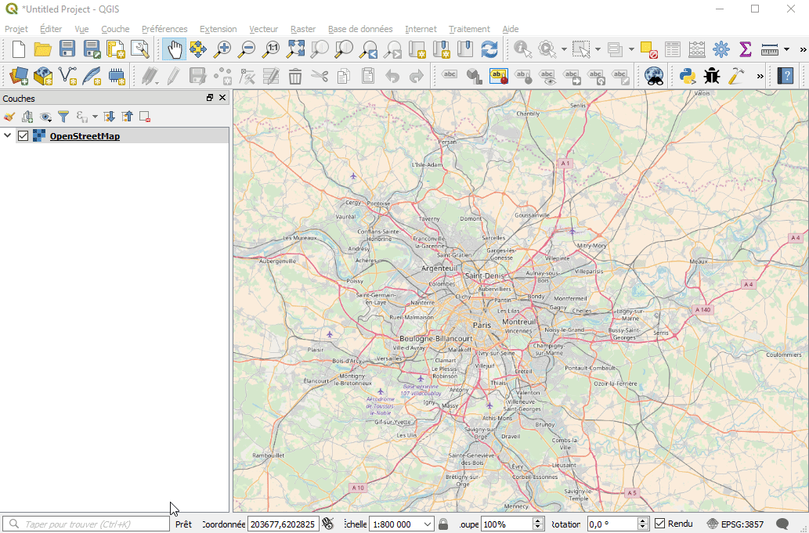

# Ban Adresse Locator

## Qu'est-ce que c'est ? 
Il s'agit d'une barre de recherche d'adresse

Les lieux de recherche possibles sont :
* commune
* voie
* lieu-dit
* plaque adresse

## Où

La recherche est exécutée à travers la [barre de recherche](https://qgis.org/en/site/forusers/visualchangelog30/#feature-locator-bar) de QGIS 3.

## Configuration de l'outil

La configuration de l'outil se fait à travers l'onglet `localisateur` dans les propriétés générales.
Vous pouvez entre autres :
* augmenter le nombre de résultat
* afficher en permanence le résultat
* accéder à la configuration du plugin

## Comment faire une recherche ?

Entrer une adresse dans la barre de recherche et les résultats s'afficheront.

